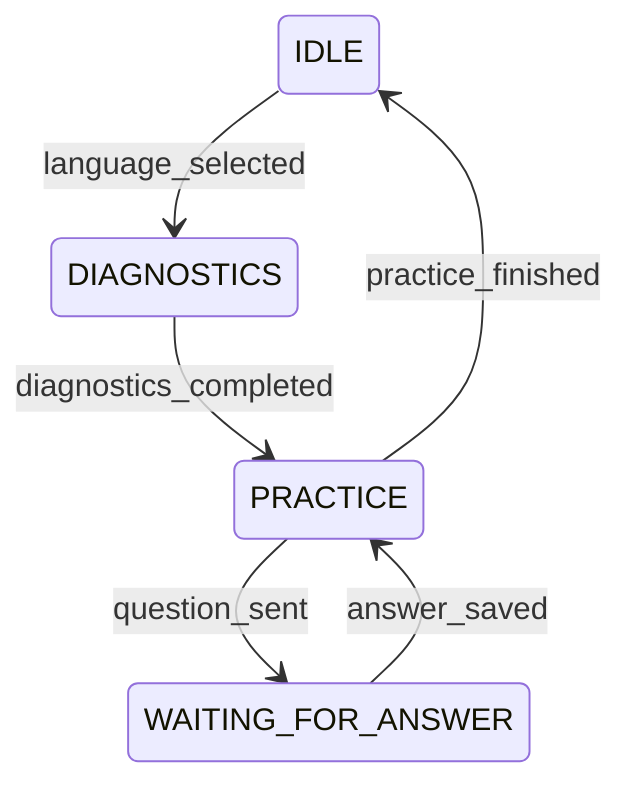

# Technical Overview

This document dives into the **implementation details** of the RecallDev Telegram bot: architectural patterns, tech-stack, data flow, and development conventions.

---

## 1. Stack

| Layer | Technology | Notes |
|-------|------------|-------|
| Bot API | **[python-telegram-bot v20](https://github.com/python-telegram-bot/python-telegram-bot)** | Async, webhook or polling. |
| Business logic | **Python 3.11** | Pure functions in `src/bot/flows/`. |
| ORM / DB | **[SQLModel](https://sqlmodel.tiangolo.com/)** + SQLite | Easy migration to Postgres; tables auto-created. |
| LLM | **LangChain** + OpenAI Chat API | Prompt templates in `constants/prompts.py`. |
| State machine | Custom enum & helpers (`state_machine.py`) | Written on top of DB → crash-resilient. |
| Tooling | `ruff`, `black`, `pytest` | Lint, format, tests. |

---

## 2. Project Layout

```
src/
├── bot/
│   ├── callbacks.py      # controllers – Telegram handlers only
│   ├── flows/            # business logic (pure)
│   ├── views/            # render FlowResult → telegram text/markup
│   ├── state_machine.py  # user state helpers (DB-backed)
│   └── flow_result.py    # FlowStatus enum + dataclass
├── db/
│   ├── models.py         # SQLModel entities
│   ├── services.py       # DB helper functions (repository layer)
│   └── db.py             # Session factory
├── constants/            # messages, callback data, prompts, etc.
└── main.py               # Application bootstrap
```

---

## 3. Core Patterns

### 3.1 MVC (Telegram-centric)

* **Controllers** (`callbacks.py`):
  * Receive `Update`/`Context`.
  * Fetch or mutate DB via `services.*`.
  * Call **Flows** → get `FlowResult`.
  * Pass result to **Views** → `(text, reply_markup)`.
  * Send message / edit message.
  * *No business decisions.*

* **Flows** (`src/bot/flows/*`):
  * Pure functions, **never import telegram**.
  * Return `FlowResult(status, data)`.
  * Contain validations, branching, persistence via `services`.

* **Views** (`src/bot/views/*`):
  * Stateless dispatch tables mapping `FlowStatus` to render helpers.
  * Assemble keyboards, plain text, markdown.

### 3.2 State Machine



* State is stored as `User.state` (string) in DB → survives restarts.
* Transition helpers: `get_user_state`, `set_user_state`, `is_in_state`.

### 3.3 FlowResult / FlowStatus

```python
class FlowStatus(StrEnum):
    OK = "ok"
    NEXT_QUESTION = "next_question"
    CONTINUE = "continue"      # answer saved, show feedback
    FINISHED = "finished"      # plan ended
    COMPLETED = "completed"    # diagnostics done
    ERROR = "error"

@dataclass(slots=True)
class FlowResult:
    status: FlowStatus
    data: dict | None = None
```

Benefits: **type-safe dispatch**, testable flows, single source of truth for statuses.

---

## 4. Data Flow Example (Practice Answer)

1. `handle_text_message` receives text.
2. Checks `UserState` → expects `WAITING_FOR_ANSWER`.
3. Calls `practice_flow.process_user_practice_answer()`.
4. Flow saves answer, asks LLM, returns `FlowResult(FlowStatus.CONTINUE, {...})`.
5. `practice_view.render` converts to *feedback text + Next button*.
6. Controller sends message.
7. `UserState` remains `PRACTICE`.

---

## 5. Database Entities (simplified)

```
User(id, telegram_id, ui_language_code, active_language_id, state)
ProgrammingLanguage(id, name, slug)
Question(id, text, category_id, language_id, is_diagnostic)
UserProgress(id, user_id, language_id, diagnostics_completed, diagnostic_scores_json)
UserLearningPlanItem(id, user_progress_id, question_id, order_index, status)
UserAnswer(id, user_id, question_id, learning_plan_item_id, answer_text, llm_explanation)
```

---

## 6. Environment Variables

| Var | Required | Description |
|-----|----------|-------------|
| `TELEGRAM_TOKEN` | ✅ | Bot token from BotFather |
| `OPENAI_API_KEY` | ✅ | API key for LLM evaluation & plan generation |
| `DATABASE_URL`   | ❌ | Custom DB URL (default SQLite) |

Create a `.env` file in project root.

---

## 7. Development Workflow

```bash
# format & lint
ruff check .
black .

# run bot locally (polling)
python src/main.py

# recreate DB with sample data
python src/main.py recreatedb
```

* Write **unit tests** for flows & services (no Telegram needed).
* Use **early returns** / guard clauses → minimal nesting.
* Prefer **dispatch dicts** over long `if/elif` chains.
