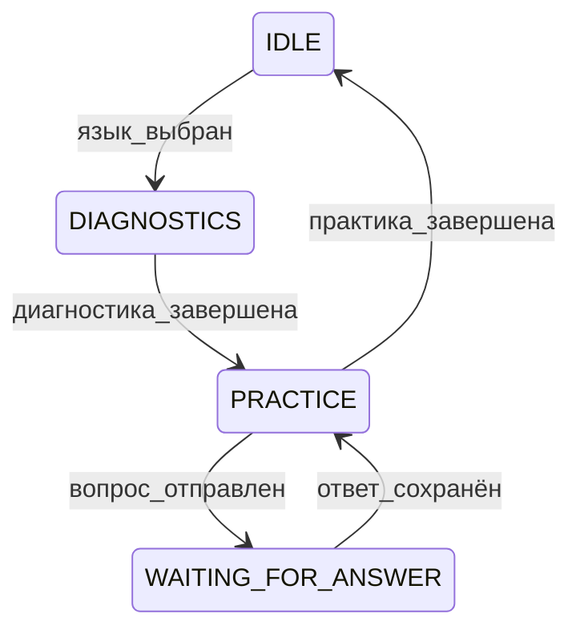

# Технический обзор проекта

Документ описывает **архитектуру**, технологии и внутренние процессы Telegram-бота *RecallDev*.

---

## 1. Стек технологий

| Слой | Технология | Назначение |
|------|------------|------------|
| Bot API | **python-telegram-bot v20** | Асинхронная работа с Telegram |
| Бизнес-логика | **Python 3.11** | Чистые функции во `flows/` |
| ORM / БД | **SQLModel + SQLite** | При необходимости легко перейти на Postgres |
| LLM | **LangChain + OpenAI Chat API** | Генерация плана и обратная связь |
| State Machine | Enum + helpers | Состояние хранится в БД |
| Инструменты | `ruff`, `black`, `pytest` | Линт, формат, тесты |

---

## 2. Структура проекта

```
src/
├── bot/
│   ├── callbacks.py      # контроллеры (Telegram-хендлеры)
│   ├── flows/            # бизнес-логика без Telegram
│   ├── views/            # преобразуют FlowResult → текст/клавиатура
│   ├── state_machine.py  # функции для работы с состоянием пользователя
│   └── flow_result.py    # Enum FlowStatus + dataclass
├── db/
│   ├── models.py         # SQLModel сущности
│   ├── services.py       # слой репозиториев
│   └── db.py             # Session factory
└── main.py               # точка входа
```

---

## 3. Ключевые паттерны

### 3.1 MVC

* **Controllers** — принимают обновления, вызывают Flows, затем Views, отправляют сообщения.
* **Flows** — чистые функции, ничего не знают о Telegram. Возвращают `FlowResult`.
* **Views** — диспатч по `FlowStatus`, формируют текст и inline-кнопки.

### 3.2 Машина состояний



Состояние (`User.state`) хранится в БД → переживает рестарты.

### 3.3 FlowResult / FlowStatus

```python
class FlowStatus(StrEnum):
    OK = "ok"
    NEXT_QUESTION = "next_question"
    CONTINUE = "continue"
    FINISHED = "finished"
    COMPLETED = "completed"

@dataclass(slots=True)
class FlowResult:
    status: FlowStatus
    data: dict | None = None
```

---

## 4. Пример потока данных (ответ на практический вопрос)

1. `handle_text_message` получает текст.
2. Проверяет `UserState` (= `WAITING_FOR_ANSWER`).
3. Вызывает `practice_flow.process_user_practice_answer()`.
4. Flow сохраняет ответ, запрашивает LLM, возвращает `FlowResult(FlowStatus.CONTINUE, ...)`.
5. View формирует фидбэк и кнопку «Следующий вопрос».
6. Контроллер отправляет сообщение.
7. `UserState` остаётся `PRACTICE`.

---

## 5. Сущности БД (упрощённо)

```
User(id, telegram_id, ui_language_code, active_language_id, state)
ProgrammingLanguage(id, name, slug)
Question(id, text, category_id, language_id, is_diagnostic)
UserProgress(id, user_id, language_id, diagnostics_completed, diagnostic_scores_json)
UserLearningPlanItem(id, user_progress_id, question_id, order_index, status)
UserAnswer(id, user_id, question_id, learning_plan_item_id, answer_text, llm_explanation)
```

---

## 6. Переменные окружения

| Переменная | Обязательна | Описание |
|------------|------------|----------|
| `TELEGRAM_TOKEN` | да | токен бота |
| `OPENAI_API_KEY` | да | ключ OpenAI |
| `DATABASE_URL` | нет | кастомный URL БД |

---

## 7. Как разрабатывать

```bash
# линт + формат
ruff check .
black .

# запустить бота (polling)
python src/main.py

# пересоздать БД с начальными данными
python src/main.py recreatedb
```

* Пишите тесты для flows и services.
* Используйте ранние return-ы вместо вложенных `if`.
* Длинные `if/elif` заменяйте на dispatch-словари.
