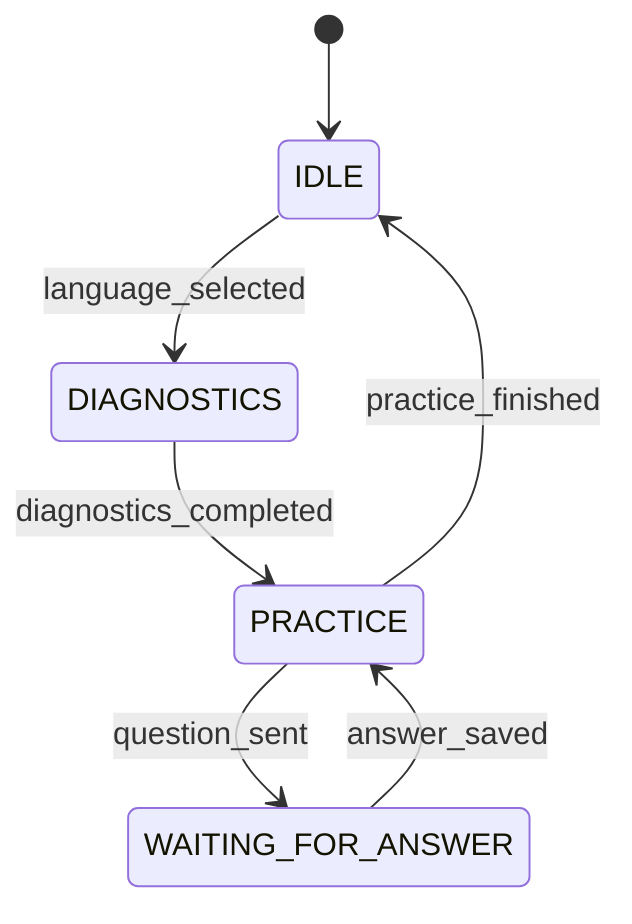

# Bot Flow Overview

Below is a concise, step-by-step description of the user journey. For a visual sequence diagram see `docs/diagrams/bot_flow.png` (not included yet).

| # | Trigger | Bot Action | User State |
|---|---------|-----------|------------|
| 1 | `/start` or `/language` | Offers to select a programming language if not yet set | `IDLE` → `IDLE` |
| 2 | Language selection | Confirms selection, auto-starts diagnostics | `IDLE` → `DIAGNOSTICS` |
| 3 | Diagnostic question | Sends diagnostic question, loads next one | `DIAGNOSTICS` |
| 4 | Score button (1-5) | Saves score, sends next diagnostic question | `DIAGNOSTICS` |
| 5 | After last diagnostic question | Saves all scores, generates practice plan via LLM, notifies user (`/practice`) | `DIAGNOSTICS` → `PRACTICE` |
| 6 | `/practice` | Checks language and diagnostics, sends current practice question or reminds of active question | `PRACTICE` & sets `WAITING_FOR_ANSWER` |
| 7 | User text answer | Sends answer to LLM, stores feedback, sends feedback + **Next question** button | `WAITING_FOR_ANSWER` |
| 8 | "Next question" button | Sends next practice question or *finished* message | `PRACTICE` |

### Notes
* Diagnostics are mandatory once per language; user may rerun via `/diagnostics`.
* Practice plan generation is fully automatic and idempotent.
* All heavy LLM calls are guarded; if unavailable, fallback messages are shown.
* Controllers (`callbacks.py`) never contain business logic — they orchestrate flows & views.

---
## Flow ↔️ State Machine

